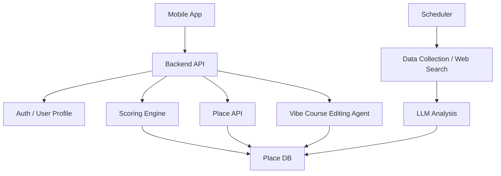

# Vibe Dating MVP 기술 검토

작성일: 2026-06-14

관련 문서:

- [MVP-기능-명세서.md](MVP-기능-명세서.md)
- [사용자-성향.md](사용자-성향.md)
- [장소-카테고리.md](장소-카테고리.md)
- [api/naver-local-api-and-place-data-strategy.md](api/naver-local-api-and-place-data-strategy.md)
- [api/kakao-local-api-spec-and-usage.md](api/kakao-local-api-spec-and-usage.md)
- [api/google-maps-api-research.md](api/google-maps-api-research.md)

## 1. 전체 시스템 구조



- Mobile App: 지도, 플레이스 리스트, 성향 온보딩, 바이브 데이트 코스 수정 UI
- Backend API: 인증, 사용자 성향 조회, 추천 조회, 플레이스 데이터 조회
- Place DB: 네이버 플레이스 ID 매핑, 우리 정의 카테고리, 외부 링크, 외부 서비스 평점, 요약, 태그별 점수
- Scoring Engine: 사용자 성향과 플레이스 태그별 점수를 조합해 추천 점수 계산
- Scheduler: 주기적으로 외부 데이터 수집과 웹 검색 실행
- Data Collection / Web Search: 외부 링크, 공개 정보, 웹 검색 결과, 출처 URL 수집
- LLM Analysis: 수집된 정보를 분석해 플레이스 요약과 태그별 점수 생성
- Vibe Course Editing Agent: 자연어 요청을 기반으로 추천 결과와 코스 수정

## 2. 핵심 데이터 흐름

### 플레이스 데이터 구축

1. 초기 오픈 지역을 선정한다.
2. 네이버 지도 API 기준으로 플레이스 ID를 확보한다.
3. 플레이스 ID별로 외부 링크, 외부 서비스 평점, 웹 검색 결과, 공개 정보를 수집한다.
4. 수집된 정보를 기반으로 AI가 간단 요약과 태그별 점수를 생성한다.
5. 저장 가능한 데이터만 Place DB에 저장한다.
6. 샘플 검수로 점수 품질을 확인한다.

### 추천 조회

1. 사용자가 로그인한다.
2. 사용자 기본 성향을 불러온다.
3. 앱에서 현재 지도 영역을 기준으로 네이버 지도 API / SDK를 사용한다.
4. 네이버 플레이스 ID로 우리 DB의 관리 데이터와 매칭한다.
5. 사용자 성향과 플레이스 태그별 점수를 조합해 추천 점수를 계산한다.
6. 추천 점수순으로 플레이스를 정렬한다.
7. 앱은 지도 마커와 하단 리스트를 표시한다.

### 바이브 데이트 코스 수정

- Phase 2에서 진행한다.
- MVP 문서에는 기능 방향만 남기고, 상세 에이전트 설계는 보류한다.

## 3. Place DB

### 저장할 핵심 데이터

MVP에서 저장할 플레이스 데이터는 Vibe Dating이 직접 관리하는 데이터로 제한한다.

- 네이버 플레이스 ID
- 카테고리 (우리 정의, [장소-카테고리.md](장소-카테고리.md) 기준)
- 외부 링크
- 외부 서비스 평점
- 간단 요약
- 태그별 점수
- 출처 URL
- 수집 시점

장소명, 주소, 좌표 등 네이버 지도 API에서 제공되는 기본 플레이스 정보는 우리 DB에서 직접 관리하지 않고, 네이버 API 응답을 사용한다.

### 저장하지 않을 데이터

- 리뷰 원문
- 블로그 문장 원문
- 외부 플랫폼 사진
- 메뉴판 이미지
- 네이버 플레이스 상세 데이터를 복제한 원본 데이터

### 기본 테이블

#### places

- id
- naver_place_id
- category
- summary
- status
- created_at
- updated_at

#### place_external_links

- id
- place_id
- provider
- external_place_id
- url
- priority
- last_checked_at

#### place_ratings

- id
- place_id
- provider
- rating
- review_count
- collected_at

#### place_tag_scores

- id
- place_id
- preference_tag_id
- score
- confidence
- scoring_version
- generated_at

#### place_source_references

- id
- place_id
- source_type
- url
- collected_at

## 4. 외부 데이터 수집

### 네이버

- 네이버 지도 기반 동작의 기준 provider로 둔다.
- 네이버 플레이스 ID를 canonical key로 사용한다.
- 장소명, 주소, 좌표 등 기본 정보는 네이버 API 응답을 사용한다.
- 네이버 플레이스 상세 데이터를 우리 DB 원본처럼 복제하지 않는다.

### 카카오 / Google

- 후보 교차 확인, 외부 링크 보강, 외부 서비스 평점 보조에 사용한다.
- 각 provider별 저장 가능 범위와 표시 조건을 확인해야 한다.

### 웹 검색 / 크롤링

- 공식 홈페이지, 인스타그램, 공개 웹 검색 결과를 참고한다.
- 분위기, 데이트 적합성, 최신성 확인에 사용한다.
- 리뷰 원문, 블로그 문장 원문, 외부 사진, 메뉴판 이미지는 저장하지 않는다.

### 데이터 구축 방식

1. 초기 오픈 지역을 선정한다.
2. 네이버 지도 API 기준 플레이스 ID를 확보한다.
3. 플레이스 ID별로 웹 검색과 외부 링크를 수집한다.
4. AI가 요약과 태그별 점수를 생성한다.
5. 외부 서비스 평점과 인기도는 보조 신호로만 사용한다.
6. 샘플 검수로 품질을 확인한다.

## 5. AI 기반 플레이스 태깅

### 입력

- 네이버 API에서 제공되는 장소명
- 네이버 API에서 제공되는 주소 / 위치 맥락
- Vibe Dating이 정의한 카테고리
- 외부 링크
- 외부 서비스 평점
- 웹 검색 결과 요약
- 공식 홈페이지 또는 인스타그램에서 확인 가능한 공개 정보
- 자체 작성 또는 AI 생성 요약

### 출력

```json
{
  "place_id": "place_123",
  "scoring_version": "v1",
  "tag_scores": [
    {
      "tag": "quiet",
      "score": 82,
      "confidence": 0.74
    },
    {
      "tag": "photo_friendly",
      "score": 68,
      "confidence": 0.63
    }
  ]
}
```

### 점수 범위

- 0~30: 거의 맞지 않음
- 31~60: 일부 맞음
- 61~80: 잘 맞음
- 81~100: 매우 잘 맞음

### 재처리 기준

- scoring_version이 변경된 경우
- 사용자 성향 태그 체계가 변경된 경우
- 플레이스 요약 또는 카테고리가 크게 변경된 경우
- 외부 링크가 변경되거나 장소 상태가 바뀐 경우
- 사용자 테스트에서 추천 품질 이슈가 반복되는 경우

## 6. 사용자 성향 기반 추천 점수

사용자 성향 문장과 내부 태그 체계는 [사용자-성향.md](사용자-성향.md)를 기준으로 한다.

### 기본 원칙

- 추천 점수는 플레이스의 절대 점수가 아니다.
- 같은 플레이스라도 사용자가 선택한 성향에 따라 추천 점수가 달라져야 한다.
- MVP에서는 사용자가 선택한 성향 태그와 플레이스 태그별 점수의 평균을 중심으로 시작한다.

### 기본 공식

```text
base_score = avg(place_tag_scores for selected_user_tags)
rating_bonus = normalized_external_rating * 0.1
missing_info_penalty = -5 if required_info_missing else 0

final_score = base_score + rating_bonus + missing_info_penalty
```

### 반영 요소

- 사용자 선택 성향 태그와 플레이스 태그 점수 매칭
- 외부 서비스 평점
- 카테고리
- 외부 링크 존재 여부
- 장소 정보 충분성
- 폐업/휴업 의심 여부

### 보류 요소

- 거리 / 이동 편의성 반영
- 카테고리 다양성 강제 보장
- 좋아요 / 싫어요 기반 개인화 보정

## 7. 바이브 데이트 코스 수정 에이전트

Phase 2에서 진행한다.

MVP 기술 검토에서는 상세 설계를 보류하고, 지원할 요청 유형만 남긴다.

- 코스 생성
- 장소 추가
- 장소 삭제
- 장소 교체
- 카테고리 변경
- 분위기 변경
- 코스 순서 변경
- 이동 거리 줄이기
- 추천 결과 재정렬
- 모호한 요청에 대한 추가 질문

## 8. 성능 / 비용

### 성능

- 지도 조회는 네이버 지도 API / SDK 사용을 전제로 한다.
- 지도 영역 판정은 네이버 API 응답 또는 단기 캐시된 좌표 정보를 기준으로 처리한다.
- 추천 점수 계산은 가능하면 사전 계산된 place_tag_scores를 활용한다.
- 지도 화면에서는 최대 반환 개수를 제한한다.
- 동일 사용자 / 동일 viewport 결과는 캐싱을 검토한다.

### 캐싱 후보

- 사용자 기본 성향
- viewport별 플레이스 조회 결과
- 플레이스별 태그 점수
- 플레이스 요약
- 외부 링크 / 외부 서비스 평점

### LLM 비용

- 플레이스 태깅은 사전 처리한다.
- 요약과 태그별 점수는 사전 생성한다.
- 실시간 LLM 호출은 Phase 2의 바이브 데이트 코스 수정에서 검토한다.
- MVP에서는 초기 지역과 사용자 수를 제한한다.

## 9. 규정 / 약관 리스크

### 웹 크롤링 / 웹 검색

- robots.txt와 각 사이트 이용약관을 확인해야 한다.
- 리뷰 원문, 블로그 문장 원문, 외부 플랫폼 사진, 메뉴판 이미지는 저장하지 않는다.
- 공개 웹 정보는 AI 태깅 참고 자료로 사용하되, 원문을 재게시하지 않는다.

### 네이버 지도 API / SDK

- 상업적 이용 가능 범위와 과금 조건을 확인해야 한다.
- 네이버 지도 API / SDK의 장소 데이터 저장 가능 범위를 확인해야 한다.
- 네이버 플레이스 상세 데이터를 우리 DB 원본처럼 복제하지 않는다.
- 장소명, 주소, 좌표는 네이버 API 응답을 사용한다는 전제로 설계한다.

### 카카오 / Google

- 외부 서비스 평점, 리뷰 수, 링크의 저장 가능 범위와 표시 조건을 확인해야 한다.
- 각 provider의 attribution / 출처 표시 조건을 확인해야 한다.

### LLM / AI 태깅

- 외부 원문을 과도하게 프롬프트나 로그에 남기지 않는다.
- 태깅 결과는 자체 분석 데이터로 저장하되, 출처 URL과 수집 시점을 함께 남긴다.
