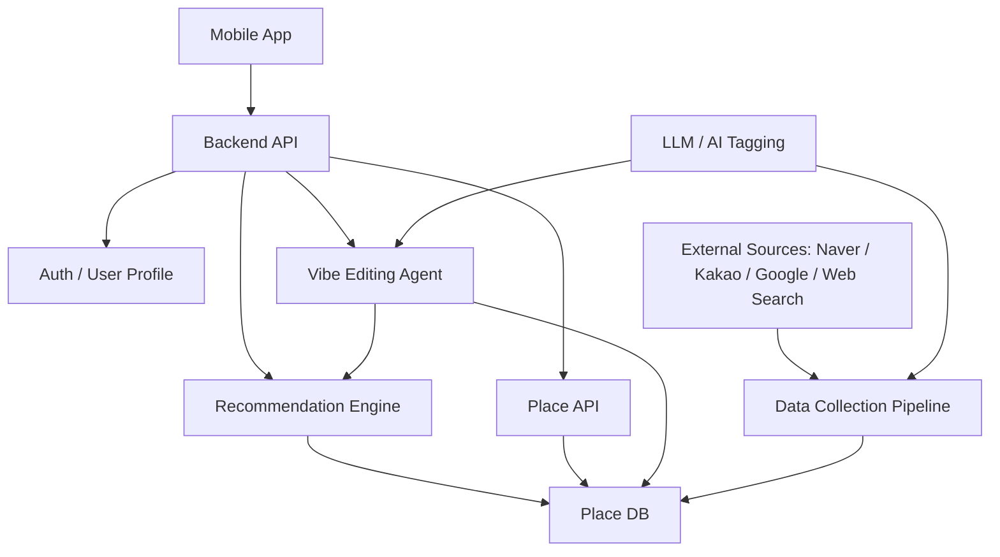

# Vibe Dating MVP Technical Review

작성일: 2026-06-14

관련 문서:

- [mvp-feature-spec.md](mvp-feature-spec.md)
- [place-db-initial-build-strategy.md](place-db-initial-build-strategy.md)
- [api/naver-local-api-and-place-data-strategy.md](api/naver-local-api-and-place-data-strategy.md)
- [api/kakao-local-api-spec-and-usage.md](api/kakao-local-api-spec-and-usage.md)
- [api/google-maps-api-research.md](api/google-maps-api-research.md)

## 1. 문서 목적

이 문서는 Vibe Dating MVP 기능 명세서에서 정의한 핵심 기능을 기술적으로 어떻게 구현할지 검토하기 위한 문서다.

MVP 기능 명세서는 사용자가 어떤 경험을 해야 하는지에 집중하고, 이 문서는 그 경험을 만들기 위해 필요한 데이터 구조, 추천 로직, 지도 조회 방식, AI 처리, 외부 데이터 활용, 운영 리스크를 다룬다.

특히 MVP의 핵심 흐름인 `Place DB -> AI 태깅 -> 사용자 성향 기반 추천 점수 -> 지도 기반 플레이스 조회 -> 바이브 수정 에이전트`를 중심으로 검토한다.

## 2. 기술 검토 범위

### 포함 범위

- 회원가입 / 로그인
- 기본 성향 저장
- Place DB 설계
- 외부 데이터 수집 및 보강
- 데이터 저장 정책
- AI 기반 플레이스 태깅
- 사용자 성향 기반 추천 점수 계산
- 현재 지도 화면 영역 기반 플레이스 조회
- 추천 점수 기반 지도 마커 표현
- 플레이스 요약 및 추천 이유 생성
- 자연어 기반 바이브 수정
- 사용자 요청 기반 코스 생성 / 수정
- 성능, 비용, 보안, 운영 리스크

### 제외 범위

- 예약
- 결제
- 커플 계정
- 좋아요/싫어요 기반 추천 고도화
- 업주용 장소 등록
- 운영자 검수 어드민 고도화
- 대규모 지역 확장 자동화

## 3. 기술 목표

MVP의 기술 목표는 다음과 같다.

1. 사용자의 기본 성향을 저장하고 추천에 반영한다.
2. 현재 지도 화면 영역 안의 플레이스를 빠르게 조회한다.
3. 플레이스를 사용자 성향에 따라 상대적으로 점수화한다.
4. 추천 이유와 요약을 사용자가 이해하기 쉽게 제공한다.
5. 사용자의 자연어 요청을 해석해 추천 결과와 코스를 수정한다.
6. 외부 데이터 사용 시 저장 가능 범위와 약관 리스크를 관리한다.
7. LLM 호출 비용과 응답 속도를 MVP 수준에서 통제한다.

## 4. 전체 시스템 구조 초안



### 주요 컴포넌트

- 모바일 앱: 지도, 플레이스 리스트, 성향 온보딩, 바이브 수정 채팅 UI 제공
- 백엔드 API: 앱 요청 처리, 인증, 추천 조회, 코스 생성, 바이브 수정 요청 처리
- Auth / User Profile: 회원 계정, 기본 성향 저장
- Place DB: 플레이스 기본 정보, 외부 링크, 평점, 요약, 태그별 점수 저장
- Recommendation Engine: 사용자 성향과 플레이스 태그별 점수를 조합해 추천 점수 계산
- Vibe Editing Agent: 자연어 요청을 해석하고 추천 결과 또는 코스를 수정
- Data Collection Pipeline: 외부 데이터 수집, 정규화, 중복 제거, AI 태깅 처리
- LLM / AI Tagging: 플레이스 태그별 점수 산정, 요약, 추천 이유, 바이브 수정 요청 해석

## 5. 핵심 데이터 흐름

### 5.1 플레이스 데이터 구축 흐름

1. 초기 오픈 지역을 선정한다.
2. 해당 지역의 데이트 가능 플레이스 후보를 수집한다.
3. 네이버, 카카오, Google, 웹서치 등을 통해 외부 링크와 보조 정보를 찾는다.
4. 동일 장소를 중복 제거하고 canonical place로 병합한다.
5. 저장 가능한 정보만 Place DB에 저장한다.
6. 수집된 정보를 기반으로 AI가 요약과 태그별 점수를 생성한다.
7. 필요 시 사람이 샘플 검수한다.
8. 앱에서는 현재 지도 영역을 기준으로 Place DB를 조회한다.

### 5.2 추천 조회 흐름

1. 사용자가 로그인한다.
2. 사용자 기본 성향을 불러온다.
3. 앱에서 현재 지도 영역을 백엔드로 전달한다.
4. 백엔드는 해당 영역 안의 플레이스를 조회한다.
5. 사용자 성향과 플레이스 태그별 점수를 조합해 추천 점수를 계산한다.
6. 추천 점수순으로 플레이스를 정렬한다.
7. 앱은 지도 마커와 하단 리스트를 표시한다.
8. 사용자는 플레이스 카드에서 요약, 추천 이유, 평점, 외부 링크를 확인한다.

### 5.3 바이브 수정 흐름

1. 사용자가 추천 화면 하단 채팅창에 자연어 요청을 입력한다.
2. Vibe Editing Agent가 요청 의도를 해석한다.
3. 요청 유형을 분류한다.
4. 필요한 경우 현재 추천 결과, 사용자 성향, 지도 영역, 플레이스 후보를 참조한다.
5. 추천 결과를 재정렬하거나 장소를 추가/삭제/교체한다.
6. 코스 생성 요청이면 장소 조합과 순서를 생성한다.
7. 모호한 요청이면 기본값으로 처리하거나 사용자에게 추가 질문한다.
8. 수정된 결과를 지도와 리스트에 다시 표시한다.

## 6. Place DB 설계 초안

### 6.1 저장할 핵심 필드

MVP에서 저장할 플레이스 데이터는 다음과 같다.

- 장소명
- 주소
- 좌표
- 카테고리
- 외부 링크
- 평점
- 간단 요약
- 태그별 점수

### 6.2 권장 테이블 초안

#### users

사용자 계정 정보를 저장한다.

- id
- email 또는 social_provider_id
- created_at
- updated_at

#### user_preference_tags

사용자의 기본 성향 문장 선택 결과를 저장한다.

- id
- user_id
- preference_tag_id
- created_at

#### preference_tags

회원가입 시 제공하는 문장형 성향 선택지를 저장한다.

- id
- label
- internal_key
- description
- is_active
- display_order

예시:

- 조용한 곳이 좋아요.
- 사진 찍는 걸 좋아해요.
- 대화하기 좋은 곳이 좋아요.
- 걷기 좋은 데이트가 좋아요.

#### places

Vibe Dating의 canonical place를 저장한다.

- id
- name
- address
- latitude
- longitude
- category
- summary
- status
- created_at
- updated_at

#### place_external_links

외부 지도/플레이스 링크를 저장한다.

- id
- place_id
- provider
- external_place_id
- url
- priority
- last_checked_at

provider 예시:

- naver
- kakao
- google
- official
- instagram

네이버 링크를 1순위로 둔다.

#### place_ratings

여러 출처의 평점을 저장한다.

- id
- place_id
- provider
- rating
- review_count
- collected_at

검토 필요:

- 각 provider별 평점 저장 가능 범위
- 장기 저장 가능 여부
- 갱신 주기
- 표시 방식

#### place_tag_scores

플레이스별 성향 태그 점수를 저장한다.

- id
- place_id
- preference_tag_id
- score
- confidence
- scoring_version
- generated_at

score는 0~100 범위를 우선 검토한다.

confidence는 AI가 산정한 점수의 신뢰도를 표현하기 위한 값이다. MVP에서는 생략 가능하지만, 추후 재검수와 재처리 우선순위에 유용할 수 있다.

#### place_source_references

플레이스 분석에 사용한 출처 URL을 저장한다.

- id
- place_id
- source_type
- url
- collected_at

주의:

- 리뷰 원문, 블로그 문장 원문, 외부 사진, 메뉴판 이미지는 저장하지 않는다.
- 출처 URL과 수집 시점만 저장한다.

## 7. 외부 데이터 수집 전략

### 7.1 외부 출처 역할

#### 네이버

우선순위가 가장 높은 외부 링크 출처다.

활용 목적:

- 사용자가 상세 정보를 확인할 수 있는 네이버 플레이스 링크 제공
- 장소 존재 여부 확인
- 현재성 확인
- 외부 이동 링크 제공

주의:

- 네이버 플레이스 상세 데이터를 우리 DB 원본처럼 복제하지 않는다.
- 저장 가능한 데이터 범위는 약관 검토가 필요하다.

#### 카카오

장소 매칭과 좌표/카테고리 보강에 활용할 수 있다.

활용 목적:

- 장소 후보 검색
- 좌표 보강
- 카테고리 보강
- 카카오맵 링크 제공

#### Google

평점, 리뷰 수, 해외 사용자 기준의 보조 신호 확인에 활용할 수 있다.

활용 목적:

- Google Maps 링크 제공
- 평점 보조
- review count 보조

주의:

- Google Places API의 데이터 저장 제한과 표시 조건을 반드시 확인해야 한다.

#### 웹서치

플레이스의 분위기, 데이트 적합성, 공식 링크, 최신성 확인에 활용한다.

활용 목적:

- 공식 홈페이지 / 인스타그램 탐색
- 최근 운영 여부 확인
- 팝업 / 전시 / 체험성 장소 탐색
- AI 태깅을 위한 참고 정보 확보

주의:

- 리뷰 원문이나 블로그 문장 원문을 저장하지 않는다.
- 외부 사진과 메뉴판 이미지를 저장하지 않는다.

### 7.2 초기 데이터 구축 방식

MVP에서는 완전 자동화보다 제한 지역 기반 반자동 구축이 현실적이다.

권장 방식:

1. 초기 오픈 지역을 선정한다.
2. 공공/오픈 데이터와 지도 API, 웹서치로 후보를 넓게 수집한다.
3. 데이트 부적합 장소를 제거한다.
4. 네이버 링크를 우선 매칭한다.
5. 카카오/Google 링크와 평점을 보조로 붙인다.
6. AI가 요약과 태그별 점수를 생성한다.
7. 샘플 검수로 품질을 확인한다.

### 7.3 갱신 전략

MVP에서는 갱신 주기를 단순하게 둔다.

- 평점: 주기적 갱신 검토
- 외부 링크: 깨진 링크 또는 장소 미노출 시 재확인
- 폐업/휴업 의심 장소: 주기적 검토
- 태그별 점수: 플레이스 정보가 크게 바뀌거나 scoring_version이 바뀔 때 재계산

## 8. 데이터 저장 정책

### 저장 가능 데이터

- 장소명
- 주소
- 좌표
- 카테고리
- 외부 링크
- 평점
- 간단 요약
- 태그별 점수
- 출처 URL
- 수집 시점

### 저장하지 않을 데이터

- 리뷰 원문
- 블로그 문장 원문
- 외부 플랫폼 사진
- 메뉴판 이미지

### 정책 원칙

Vibe Dating은 외부 콘텐츠 원문을 복제하는 서비스가 아니다.

외부 데이터는 후보 발굴, 현재성 확인, 링크 연결, AI 태깅의 참고 정보로 사용한다.

우리 DB의 핵심 자산은 자체적으로 정리한 데이트 맥락 데이터와 사용자 성향 기반 추천 점수다.

## 9. 성향 문장 / 태그 체계

### 9.1 사용자-facing 성향 문장

사용자는 회원가입 시 문장형 성향을 선택한다.

예시:

- 조용한 곳이 좋아요.
- 사진 찍는 걸 좋아해요.
- 대화하기 좋은 곳이 좋아요.
- 걷기 좋은 데이트가 좋아요.
- 실내 위주가 좋아요.
- 트렌디한 곳이 좋아요.

초기에는 적은 수의 문장으로 시작하고, 사용자 테스트 결과를 바탕으로 확장한다.

### 9.2 내부 태그

문장형 성향은 내부적으로 추천 계산에 쓰기 쉬운 태그로 매핑할 수 있다.

예시:

- 조용한 곳이 좋아요 -> quiet
- 사진 찍는 걸 좋아해요 -> photo_friendly
- 대화하기 좋은 곳이 좋아요 -> conversation_friendly
- 걷기 좋은 데이트가 좋아요 -> walkable_date
- 실내 위주가 좋아요 -> indoor
- 트렌디한 곳이 좋아요 -> trendy

검토 필요:

- 사용자-facing 문장과 내부 태그를 1:1로 둘지
- 하나의 문장이 여러 내부 태그로 확장될 수 있는지
- 태그별 가중치를 둘지

## 10. AI 기반 플레이스 태깅 로직

### 10.1 목적

플레이스별로 각 성향 태그에 얼마나 잘 맞는지 점수화한다.

예시:

- 조용한 곳이 좋아요: 85점
- 사진 찍는 걸 좋아해요: 72점
- 트렌디한 곳이 좋아요: 64점

### 10.2 입력 데이터

AI 태깅 입력으로 사용할 수 있는 정보:

- 장소명
- 카테고리
- 주소 / 위치 맥락
- 외부 링크
- 평점
- 웹서치 결과 요약
- 공식 홈페이지 또는 인스타그램에서 확인 가능한 공개 정보
- 자체 작성 또는 AI 생성 요약

주의:

- 리뷰 원문, 블로그 문장 원문은 저장하지 않는다.
- 필요 시 태깅 처리 시점의 임시 입력으로만 사용 가능한지 약관 검토가 필요하다.

### 10.3 출력 형식

AI 태깅 결과는 구조화된 JSON 형태로 저장하는 것이 좋다.

예시:

```json
{
  "place_id": "place_123",
  "scoring_version": "v1",
  "tag_scores": [
    {
      "tag": "quiet",
      "score": 82,
      "confidence": 0.74,
      "reason": "대화 중심의 차분한 분위기에 적합한 장소로 판단됨"
    },
    {
      "tag": "photo_friendly",
      "score": 68,
      "confidence": 0.63,
      "reason": "공간 분위기와 시각적 요소가 일부 확인됨"
    }
  ]
}
```

MVP에서는 `reason`을 저장할지 여부를 별도로 검토한다. 추천 이유 생성에 도움이 되지만, 외부 원문에 과도하게 의존하지 않도록 주의해야 한다.

### 10.4 점수 범위

우선 0~100점 범위를 사용한다.

- 0~30: 거의 맞지 않음
- 31~60: 일부 맞음
- 61~80: 잘 맞음
- 81~100: 매우 잘 맞음

### 10.5 재처리 기준

다음 경우 AI 태깅을 다시 수행한다.

- scoring_version이 변경된 경우
- 성향 태그 체계가 변경된 경우
- 플레이스 요약 또는 카테고리가 크게 변경된 경우
- 외부 링크가 변경되거나 장소 상태가 바뀐 경우
- 사용자 테스트에서 추천 품질 이슈가 반복되는 경우

## 11. 사용자 성향 기반 추천 점수 계산

### 11.1 기본 원칙

추천 점수는 플레이스의 절대 점수가 아니다.

같은 플레이스라도 사용자가 선택한 성향 문장에 따라 추천 점수가 달라져야 한다.

### 11.2 MVP 기본 공식 후보

초기 공식은 단순 가중 평균으로 시작할 수 있다.

```text
recommendation_score =
  selected_tag_score_average
  + rating_adjustment
  + distance_adjustment
  + category_adjustment
  - penalty
```

MVP 1차에서는 지나치게 복잡한 공식을 피하고, 사용자가 선택한 성향 태그와 플레이스 태그별 점수의 평균을 중심으로 시작한다.

### 11.3 반영 후보 요소

- 사용자 선택 성향 태그와 플레이스 태그 점수 매칭
- 현재 지도 영역 내 위치
- 평점
- 카테고리
- 외부 링크 존재 여부
- 장소 정보 충분성
- 폐업/휴업 의심 여부
- 코스 생성 시 이동 거리

### 11.4 MVP 권장 계산 방식

MVP 1차에서는 아래 순서를 권장한다.

1. 현재 지도 영역 안의 플레이스를 조회한다.
2. 사용자가 선택한 기본 성향 태그만 대상으로 한다.
3. 해당 태그들의 플레이스 점수를 평균낸다.
4. 평점과 정보 부족 여부는 약한 보정값으로만 반영한다.
5. 최종 점수순으로 정렬한다.

예시:

```text
base_score = avg(place_tag_scores for selected_user_tags)
rating_bonus = normalized_rating * 0.1
missing_info_penalty = -5 if required_info_missing else 0

final_score = base_score + rating_bonus + missing_info_penalty
```

검토 필요:

- 평점을 얼마나 강하게 반영할지
- 거리/이동 편의성을 장소 추천 단계에서 반영할지, 코스 생성 단계에서만 반영할지
- 카테고리 다양성을 추천 결과에 강제로 보장할지

## 12. 지도 기반 검색 로직

### 12.1 기본 방식

MVP에서는 현재 지도에 보이는 화면 영역을 기준으로 플레이스를 조회한다.

앱은 지도 viewport의 경계 좌표를 백엔드에 전달한다.

백엔드는 해당 bounding box 안의 플레이스를 조회하고, 사용자 성향 기반 추천 점수순으로 반환한다.

### 12.2 요청 파라미터 초안

```json
{
  "north_east": {
    "lat": 37.55,
    "lng": 127.05
  },
  "south_west": {
    "lat": 37.52,
    "lng": 127.01
  },
  "zoom": 15,
  "limit": 100
}
```

### 12.3 성능 고려

- 좌표 기반 인덱스가 필요하다.
- 지도 이동 중에는 요청을 debounce해야 한다.
- 너무 넓은 영역에서는 limit 또는 클러스터링이 필요하다.
- 추천 점수 계산은 가능하면 사전 계산된 place_tag_scores를 활용한다.
- 사용자별 최종 추천 점수는 요청 시 계산하되, 동일 사용자/동일 viewport는 캐싱할 수 있다.

### 12.4 마커 강약 표현

추천 점수에 따라 지도 마커의 시각적 강약을 다르게 표현한다.

예시:

- 80점 이상: 진한 색 / 큰 마커
- 60~79점: 중간 색
- 40~59점: 옅은 색
- 40점 미만: 더 옅게 표시하거나 숨김 검토

MVP에서는 점수가 낮은 플레이스도 모두 보여주되, 시각적 우선순위를 낮추는 방향으로 시작한다.

## 13. 플레이스 요약 / 추천 이유 생성

### 13.1 간단 요약

플레이스 카드에는 사용자가 빠르게 판단할 수 있는 간단 요약을 표시한다.

요약은 다음 정보를 바탕으로 생성한다.

- 카테고리
- 위치
- 공개적으로 확인 가능한 장소 특성
- 데이트 맥락
- 내부 태그 점수

### 13.2 추천 이유

추천 이유는 사용자가 선택한 성향과 플레이스의 태그별 점수를 기반으로 생성한다.

예시:

- 조용한 대화 중심 데이트를 선호하는 성향과 잘 맞아요.
- 사진 찍기 좋은 분위기를 찾는 사용자에게 잘 맞는 후보예요.
- 현재 지도 영역 안에서 실내 데이트 성향과 잘 맞는 장소예요.

### 13.3 주의사항

- 확인되지 않은 사실을 단정하지 않는다.
- 외부 리뷰나 블로그 문장을 그대로 재사용하지 않는다.
- 과장된 표현을 피한다.
- 추천 이유는 성향 매칭 근거 중심으로 작성한다.

검토 필요:

- 추천 이유를 사전 생성할지, 요청 시 생성할지
- LLM 비용을 줄이기 위한 템플릿 기반 생성 가능성
- 생성 문구 검수 방식

## 14. 바이브 수정 AI 에이전트 설계

### 14.1 역할

바이브 수정 에이전트는 사용자의 자연어 요청을 해석해 추천 결과나 코스를 수정한다.

예시 요청:

- 여기에서 제일 괜찮은 코스 하나만 만들어줘.
- 두 번째 카페는 마음에 안 들어. 다른 걸로 넣어줘.
- 저녁 파스타 말고 고기.
- 도보 거리 줄이는 편으로 반영해줘.
- 점심 후 카페를 카페 후 저녁 구조로 바꿔줘.
- 조금 더 조용한 느낌으로 바꿔줘.

### 14.2 요청 유형

에이전트가 분류해야 하는 요청 유형은 다음과 같다.

- 코스 생성
- 장소 추가
- 장소 삭제
- 장소 교체
- 카테고리 변경
- 분위기 변경
- 코스 순서 변경
- 이동 거리 줄이기
- 추천 결과 재정렬
- 모호한 요청에 대한 추가 질문

### 14.3 입력 컨텍스트

에이전트는 다음 정보를 참조할 수 있다.

- 사용자 기본 성향
- 현재 지도 영역
- 현재 추천 결과
- 현재 코스가 있다면 코스 순서
- 플레이스별 카테고리
- 플레이스별 좌표
- 플레이스별 태그 점수
- 플레이스별 평점
- 사용자의 자연어 요청

### 14.4 출력 형식

바이브 수정 결과는 구조화된 action 형태로 반환하는 것이 좋다.

예시:

```json
{
  "intent": "replace_place",
  "target": {
    "course_position": 2,
    "category": "cafe"
  },
  "constraints": {
    "prefer_tags": ["quiet"],
    "avoid_categories": []
  },
  "actions": [
    {
      "type": "remove_place",
      "place_id": "place_cafe_1"
    },
    {
      "type": "add_place",
      "place_id": "place_cafe_2",
      "position": 2
    }
  ],
  "message": "두 번째 카페를 더 조용한 분위기의 카페로 바꿨어요."
}
```

### 14.5 모호한 요청 처리

모호한 요청은 두 방식 중 하나로 처리한다.

1. 합리적인 기본값으로 처리한다.
2. 사용자에게 추가 질문을 한다.

추가 질문이 필요한 경우:

- 지역이 너무 넓거나 불명확한 경우
- 시간대가 코스 구성에 필수인데 없는 경우
- 사용자가 상충되는 조건을 입력한 경우
- 선택 가능한 후보가 부족한 경우

예시:

- "저녁 위주로 만들까요, 카페까지 포함할까요?"
- "도보 이동 기준으로 줄일까요, 대중교통 이동까지 포함할까요?"

## 15. 코스 생성 / 수정 로직

### 15.1 기본 원칙

코스는 자동으로 항상 생성하지 않는다.

사용자가 요청했을 때 추천된 플레이스 또는 지도 영역의 플레이스를 조합해 생성한다.

### 15.2 코스 구성 후보

MVP에서 우선 지원할 코스 구조:

- 카페 -> 저녁
- 점심 -> 카페
- 전시/체험 -> 카페
- 저녁 -> 술집
- 산책 -> 카페

### 15.3 코스 생성 기준

코스 생성 시 고려할 요소:

- 사용자 기본 성향
- 현재 지도 영역
- 카테고리 조합
- 장소별 추천 점수
- 장소 간 거리
- 이동 순서
- 평점
- 외부 링크 존재 여부

### 15.4 거리 계산

MVP에서는 직선거리 또는 도보 거리 근사값으로 시작할 수 있다.

정확한 경로 최적화는 후순위로 둔다.

검토 필요:

- 지도 API의 route/direction API 사용 여부
- 비용과 호출 제한
- 도보 거리와 실제 이동 시간 표시 여부

### 15.5 코스 수정

사용자는 자연어로 코스를 수정할 수 있다.

가능한 수정:

- 장소 교체
- 장소 삭제
- 장소 추가
- 순서 변경
- 카테고리 변경
- 이동 거리 줄이기
- 분위기 변경

## 16. API 설계 초안

### Auth / User

```text
POST /auth/signup
POST /auth/login
GET /me
```

### User Preferences

```text
GET /preference-tags
GET /me/preferences
PUT /me/preferences
```

### Places / Recommendations

```text
POST /places/search-by-viewport
POST /recommendations/viewport
GET /places/{placeId}
```

### Vibe Editing / Courses

```text
POST /vibe/edit
POST /courses/generate
POST /courses/{courseId}/edit
```

### 요청 / 응답 예시

#### POST /recommendations/viewport

요청:

```json
{
  "viewport": {
    "north_east": {
      "lat": 37.55,
      "lng": 127.05
    },
    "south_west": {
      "lat": 37.52,
      "lng": 127.01
    }
  },
  "limit": 100
}
```

응답:

```json
{
  "places": [
    {
      "id": "place_123",
      "name": "Example Cafe",
      "category": "cafe",
      "latitude": 37.54,
      "longitude": 127.03,
      "recommendation_score": 84,
      "summary": "조용한 분위기의 카페",
      "recommendation_reason": "조용한 곳을 선호하는 성향과 잘 맞아요.",
      "ratings": [
        {
          "provider": "naver",
          "rating": 4.5
        }
      ],
      "external_links": [
        {
          "provider": "naver",
          "url": "https://..."
        }
      ]
    }
  ]
}
```

## 17. 성능 / 비용 검토

### 17.1 성능 고려

- 지도 이동 시 요청이 잦아질 수 있다.
- viewport 기반 조회는 좌표 인덱스가 필요하다.
- 추천 점수 계산은 요청마다 모든 플레이스를 대상으로 수행하면 느려질 수 있다.
- 지도 화면에서는 최대 반환 개수를 제한해야 한다.
- 바텀시트 리스트는 점수순 상위 후보를 우선 노출한다.

### 17.2 캐싱 전략

캐싱 후보:

- 사용자 기본 성향
- viewport별 플레이스 조회 결과
- 플레이스별 태그 점수
- 플레이스 요약
- 추천 이유
- LLM 바이브 수정 결과 일부

### 17.3 LLM 비용 관리

LLM은 다음 작업에 사용될 수 있다.

- 플레이스 태그별 점수 생성
- 플레이스 요약 생성
- 추천 이유 생성
- 바이브 수정 요청 해석
- 코스 생성 / 수정

비용 절감 방향:

- 플레이스 태깅은 사전 처리한다.
- 요약과 기본 추천 이유는 사전 생성한다.
- 실시간 LLM 호출은 바이브 수정과 코스 생성에 집중한다.
- 반복 요청은 캐싱한다.
- MVP에서는 초기 지역과 사용자 수를 제한한다.

## 18. 보안 / 개인정보

### 개인정보

MVP에서 수집하는 개인정보는 최소화한다.

수집 후보:

- 로그인 식별 정보
- 기본 데이트 성향

위치 정보:

- MVP에서는 사용자의 실시간 위치보다 현재 지도 화면 영역 기반 조회를 우선한다.
- 현재 위치 기능을 넣는 경우 명시적 권한 요청이 필요하다.

### 보안 고려

- 인증 토큰 관리
- 사용자 성향 데이터 접근 제어
- 외부 API 키 서버 측 보관
- LLM 요청 로그에 개인정보가 과도하게 남지 않도록 관리

## 19. 운영 / 갱신 전략

### 19.1 초기 운영

MVP는 제한 지역과 제한 사용자로 운영한다.

초기에는 데이터 자동화보다 추천 품질 검증이 중요하므로, 일부 수동 검수와 샘플 점검을 포함한다.

### 19.2 품질 관리

확인할 항목:

- 추천 상위 장소가 실제로 데이트에 적합한가
- 성향과 장소 매칭이 납득 가능한가
- 추천 이유가 과장되거나 어색하지 않은가
- 외부 링크가 정상 작동하는가
- 평점 정보가 오래되지 않았는가

### 19.3 데이터 갱신

- 장소 상태 변경 확인
- 평점 갱신
- 외부 링크 갱신
- 태그 점수 재계산
- 신규 플레이스 추가

## 20. 기술 리스크

### 외부 데이터 약관 리스크

네이버, 카카오, Google, 웹 콘텐츠는 각각 저장 가능 범위와 표시 조건이 다를 수 있다.

대응:

- 원문 저장을 피한다.
- 출처 URL과 최소 메타데이터 중심으로 저장한다.
- 약관 검토 후 저장 필드를 확정한다.

### AI 점수 품질 리스크

AI가 태그별 점수를 부정확하게 산정할 수 있다.

대응:

- 초기에는 샘플 검수한다.
- scoring_version을 둔다.
- 사용자 테스트 결과를 기반으로 태그와 프롬프트를 개선한다.

### 추천 이유 신뢰성 리스크

추천 이유가 실제 장소 특성과 맞지 않거나 과장될 수 있다.

대응:

- 추천 이유는 성향 매칭 중심으로 제한한다.
- 확인되지 않은 사실을 단정하지 않는다.
- 템플릿 기반 생성도 검토한다.

### 지도 성능 리스크

지도 이동마다 추천 조회가 발생하면 느려질 수 있다.

대응:

- debounce 적용
- viewport 결과 캐싱
- 조회 limit 적용
- 좌표 인덱스 적용

### LLM 비용 리스크

바이브 수정과 코스 생성 요청이 늘어나면 비용이 증가할 수 있다.

대응:

- 사전 생성 가능한 작업과 실시간 작업을 분리한다.
- 실시간 LLM 호출은 바이브 수정 중심으로 제한한다.
- 요청당 토큰과 응답 구조를 제한한다.

## 21. MVP 구현 우선순위

### 1차 구현 필수

- 회원가입 / 로그인
- 기본 성향 저장
- Place DB 기본 스키마
- 현재 지도 영역 기반 플레이스 조회
- 사용자 성향 기반 추천 점수 계산
- 지도 마커 / 리스트 표시용 API
- 플레이스 카드 데이터 제공
- 바이브 수정 요청 처리
- 사용자 요청 기반 코스 생성

### 1차 구현 중요

- 평점 출처별 저장
- 네이버 외부 링크 우선 제공
- 추천 점수 기반 마커 강약 표시
- 모호한 요청에 대한 추가 질문
- 성향 수정
- 추천 이유 생성

### 후순위

- 좋아요/싫어요 피드백 기반 추천 보정
- 이전 추천 기록
- 코스 저장
- 고급 관리자 검수 화면
- 자동 지역 확장 파이프라인
- 정교한 경로 최적화

## 22. 미결정 사항

아래 항목은 추가 검토가 필요하다.

- 모바일 앱 기술 스택
- 백엔드 기술 스택
- DB 종류와 지리 좌표 인덱싱 방식
- 지도 SDK 선택
- 네이버/카카오/Google 데이터 저장 가능 범위
- 평점 저장 및 갱신 정책
- 초기 오픈 지역
- 초기 성향 문장 목록
- AI 태깅 프롬프트
- 추천 점수 공식 v1
- 바이브 수정 에이전트의 LLM 모델
- 코스 생성 시 거리 계산 방식
- 추천 이유를 사전 생성할지 실시간 생성할지
- 수동 검수 범위

## 23. 다음 작업

기술 검토 문서를 기반으로 다음 문서를 별도로 작성한다.

1. Place DB 스키마 상세 설계
2. AI 태깅 / 추천 점수 계산 v1
3. 바이브 수정 에이전트 동작 정의
4. 초기 오픈 지역 데이터 구축 계획
5. 지도 기반 모바일 UX 상세 설계
